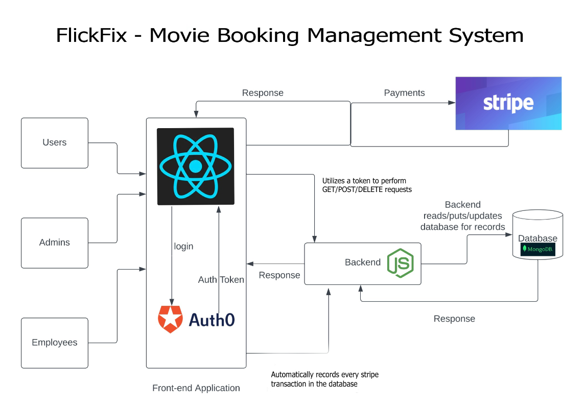

# 🎬 FlickFix – Online Movie Ticket Booking Platform

## 📌 Problem Statement
With increasing demand for a hassle-free and smart way to book movie tickets, traditional platforms often fall short when it comes to **customization**, **admin control**, and **scalability**. **FlickFix** reimagines the movie ticket booking experience for both customers and theater owners through a modern, robust, and user-centric system.

FlickFix is designed to:
- Simplify ticket booking for users
- Provide admin-level control for managing listings and operations
- Support theatre owners with tools to manage screens and shows
- Enable secure, real-time, and scalable ticketing infrastructure

---

## 🎯 Objectives
To redesign and enhance the traditional movie ticket booking system by focusing on:
- Improved UX/UI for customers and theatre owners
- Real-time bookings and seat visibility
- Admin and owner control panels
- Integration with modern payment systems
- Scalable and modular system design

---

## 🎥 Project Demo

## System Design

## 🚀 Key Features

- 🔍 Browse & Search Movies by location, genre, and rating  
- 🪑 Real-Time Seat Booking with Live Availability  
- 🛠️ Admin Dashboard for movie uploads, approvals, and system settings  
- 🎭 Theatre Owner Panel to manage shows, theatres, and schedules  
- 💳 Integrated Razorpay Payment Gateway  
- 🔐 Secure Authentication with role-based access (User, Admin, Owner)  
- 🧾 View Booking History and Upcoming Shows  
- 📱 Fully Responsive Design for mobile and desktop users  

---

## 👥 Team Members

- Parth Dali  
- Archita Palkar  
- Hemesh Malathi  
- Sarthak Choudhary  
- Ashutosh Jagdale  

---

## 🖼️ Screenshots  
> *(Insert screenshots here for Home Page, Seat Selection, Admin Dashboard, etc.)*

---

## 🧱 Tech Stack Used:

### 💻 Frontend:
- React.js  
- Ant Design  
- Redux Toolkit  
- Axios  

### 🖥️ Backend:
- Node.js  
- Express.js  
- RESTful APIs  

### 🗃️ Database:
- MongoDB  

### 🛠️ Tools & Dev:
- Visual Studio Code  
- Git & GitHub  
- Postman (API testing)

---

## 🧩 User Roles & Interfaces

### 👤 General Users:
- Browse movies
- Select theatres and book tickets
- View booking history

### 🏢 Theatre Owners:
- Register and manage their theatres
- Add shows, timings, and seat plans
- Monitor bookings

### 🛡️ Admin:
- Manage all users and roles
- Approve theatre owner accounts
- Upload movies and configure platform settings

---

## 📝 Future Improvements
- 📲 Mobile App version (React Native)
- 💬 Real-time Customer Support Chat
- 📊 Analytics Dashboard for theatre owners
- 🎯 Recommendation System based on user preferences

---

## 📄 Documentation
- Final Report: [link]  
- Final Presentation: [link]  

---
